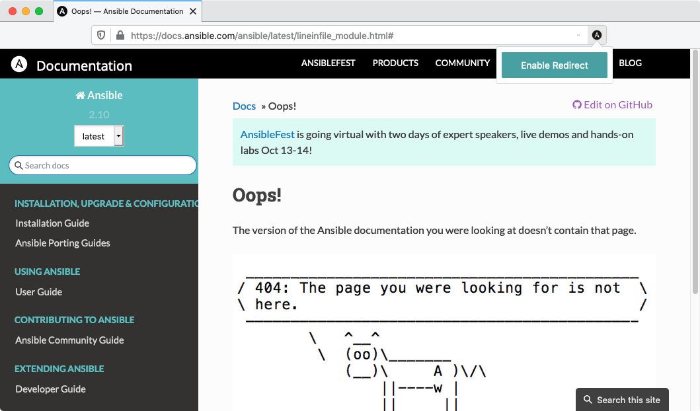
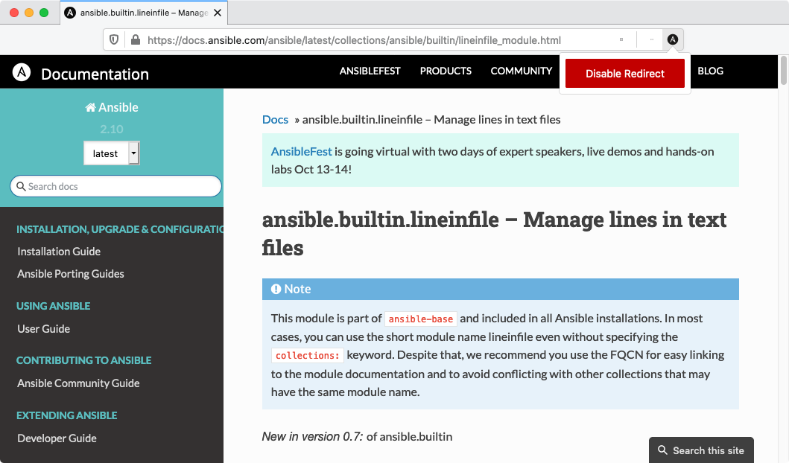

# ansible-redirect

Google search results and plugin links (looking at you, [VSCode Ansible extension](https://marketplace.visualstudio.com/items?itemName=vscoss.vscode-ansible&ssr=false#review-details)) very often have links to the old docs structure of Ansible. This extension will automatically redirect the old link structure to the new one where possible.

## Install

The extension is available on:

* [Firefox Addons](https://addons.mozilla.org/addon/ansible-redirect/).

## Configuration

When on `docs.ansible.com` you can click on the extension icon to temporarily disable redirecting.
